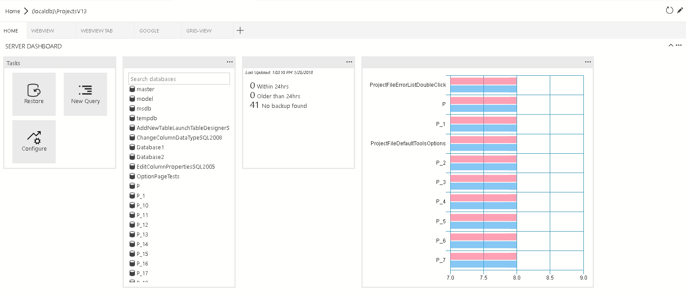
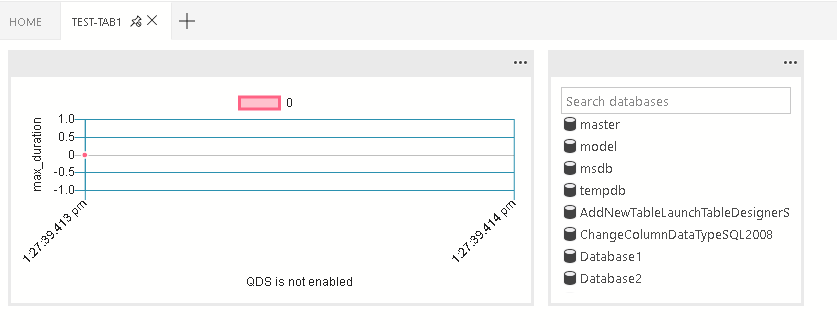
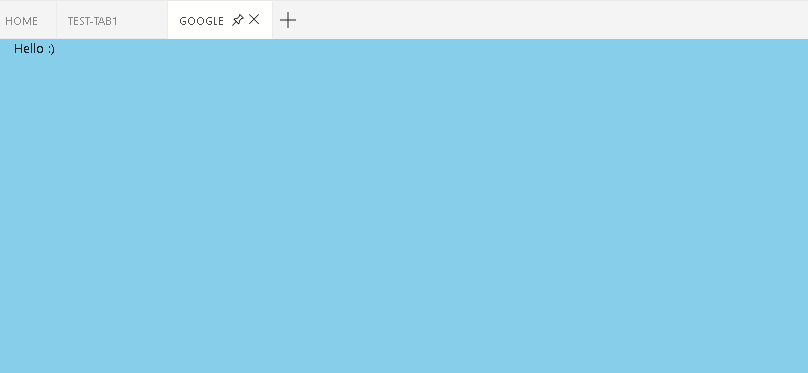
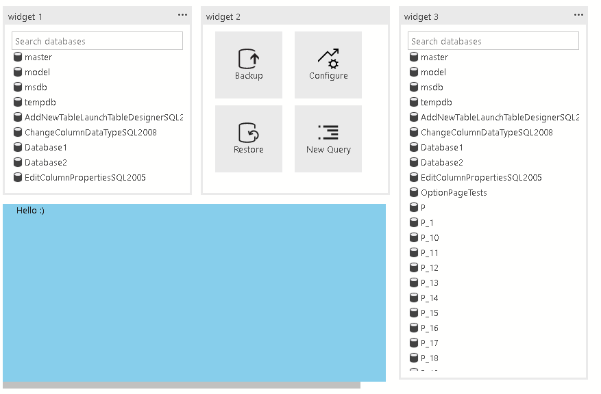
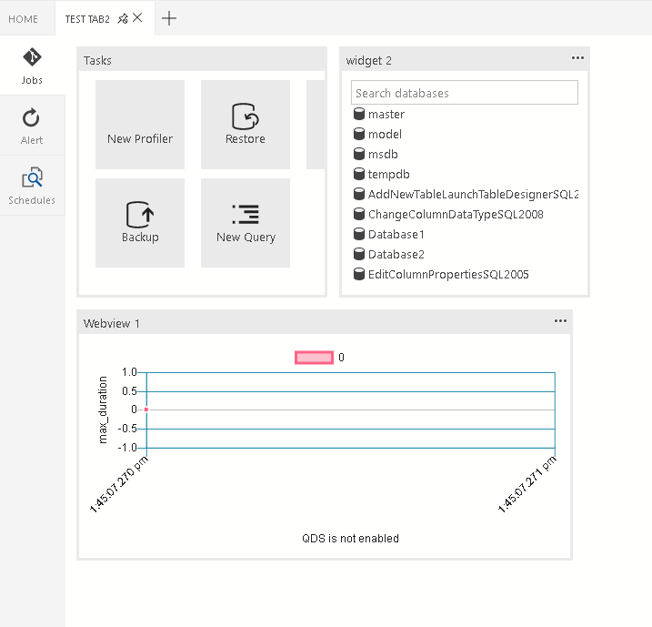

This document covers the various contribution points that are defined in the package.json extension manifest.

The intellisense is supported inside sqlopsstudio.

## Contributes dashboard
Contribute tab, container, insight widget to the dashboard.


`dashboard.tabs`

Dashboard.tabs will create the tab sections inside the dashboard page. It excepts an object or an array of the object.  

```
"dashboard.tabs": [
	{
		"id": "test-tab1",
		"title": "Test 1",
		"description": "The test 1 displays a list of widgets.",
		"when": "connectionProvider == 'MSSQL' && !mssql:iscloud",
		"alwaysShow": true,
		"container": {
			…
		}
	}
]
```

`dashboard.containers`

Instead of specify dashboard container inline (inside the dashboard.tab). You can register containers using dashboard.containers. It excepts an object or an array of the object.

```
"dashboard.containers": [
	{
		"id": "innerTab1",
		"container": {
			…
		}
	},
	{
		"id": "innerTab2",
		"container": {
			…
		}
	}
]
```

To refer to registered container, you can simply specify the id of the container

```
"dashboard.tabs": [
	{
		...
		"container": {
			"innerTab1": {             
			}
		}
	}
]

```

`dashboard.insights`

You can register insights using dashboard.insights. This is similiar to [Tutorial: Build a custom insight widget](https://docs.microsoft.com/en-us/sql/sql-operations-studio/tutorial-build-custom-insight-sql-server)

```
"dashboard.insights": {
	"id": "my-widget"
	"type": {
		"count": {
			"dataDirection": "vertical",
			"dataType": "number",
			"legendPosition": "none",
            "labelFirstColumn": false,
			"columnsAsLabels": false
        }
    },
    "queryFile": "{your file folder}/activeSession.sql"
}
```


### Dashboard container types

There are 4 different container types that we currently support:

1. ### `widgets-container`
	
	The list of widgets that will be displayed in the container. It’s a flow layout. It accepts the list of widgets.

	```
	"container": {
		"widgets-container": [
			{
				"widget": {
					"query-data-store-db-insight": {
					}
				}
			},
			{
				"widget": {
					"explorer-widget": {
					}
				}
			}
		]
	}
	```
	
2. 	### `webview-container`
	
	The webview will be displayed in the entire container. It expects webview id to be the same is tab ID

	```
	"container": {
		"webview-container": null
	}
	```
	
3. 	### `grid-container`
	
	The list of widgets or webviews that will be displayed in the grid layout

	```
	"container": {
		"grid-container": [
			{
				"name": "widget 1",
				"widget": {
					"explorer-widget": {
					}
				},
				"row":0,
				"col":0
			},
			{
				"name": "widget 2",
				"widget": {
					"tasks-widget": {
						"backup", 
						"restore",
						"configureDashboard",
						"newQuery"
					}
				},
				"row":0,
				"col":1
			},
			{
				"name": "Webview 1",
				"webview": {
					"id": "google"
				},
				"row":1,
				"col":0,
				"colspan":2
			},
			{
				"name": "widget 3",
				"widget": {
					"explorer-widget": {}
				},
				"row":0,
				"col":3,
				"rowspan":2
			},
		]
	```

4. 	### `nav-section`
	
	The navigation section will be displayed in the container

	```
	"container": {
		"nav-section": [
			{
				"id": "innerTab1",
				"title": "inner-tab1",
				"icon": {
					"light": "./icons/tab1Icon.svg",
					"dark": "./icons/tab1Icon_dark.svg"
				}
				"container": {
					…
				}
			},
			{
				"id": "innerTab2",
				"title": "inner-tab2",
				"icon": {
					"light": "./icons/tab2Icon.svg",
					"dark": "./icons/tab2Icon_dark.svg"
				}
				"container": {
					…
				}
			}
		]
	}
	```