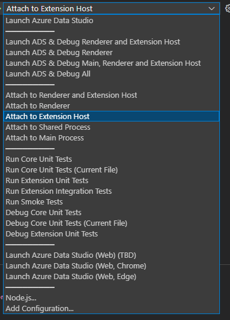

In order to download necessary tools, clone the repository, and install dependencies via `yarn` you need network access.

You'll need the following tools:

- [Git](https://git-scm.com)
- [Node.JS](https://nodejs.org/en/), **x64**, version `>= 10.x`, `<= 14.x`
- [Yarn](https://yarnpkg.com/en/), follow the [installation guide](https://yarnpkg.com/en/docs/install)
- [Python](https://www.python.org/downloads/) (required for node-gyp; check the [node-gyp readme](https://github.com/nodejs/node-gyp#installation) for the currently supported Python versions)
  - **Note:** Python will be automatically installed for Windows users through installing `windows-build-tools` npm module (see below)
- A C/C++ compiler tool chain for your platform:
  - **Windows**
    - Set a `PYTHON` environment variable pointing to your `python.exe`. E.g.: `C:\Python\python.exe`
	- Install a compiler for the native modules VS Code is depending on
		- Option 1 (recommended): Use Windows Build Tools npm module
			- Start Powershell as Administrator and install [Windows Build Tools npm module](https://github.com/felixrieseberg/windows-build-tools) ([documentation](https://github.com/felixrieseberg/windows-build-tools#visual-studio-2017-vs-visual-studio-2015)).

				**Note:** If you get _The build tools for v141 (Platform Toolset = 'v141') cannot be found_ when you run `yarn` later, you might need to delete `VCTargetsPath` from your environment variables before installing.
				```
				npm install --global windows-build-tools --vs2017
				```
				**Note:** The `--debug` flag is helpful if you encounter any problems during installation.

				**Note:** if you have installed a previous version of the build tools using the `--vs2015` flag you need to uninstall the build tools first using `npm uninstall global windows-build-tools` and the Windows Control Panel to uninstall the binaries.

		- Option 2: Use Visual Studio 2019
			- Install [Visual Studio 2019 Community Edition](https://visualstudio.microsoft.com/downloads/)
			- Select *Desktop Development with C++*
			- Select *MSVC v142 - VS 2019 C++ x64/x86 build tools (v14.28)* on the right hand side
	- **Restart** your computer
    - **Warning:** Make sure your profile path only contains ASCII letters, e.g. *John*, otherwise it can lead to [node-gyp usage problems (nodejs/node-gyp/issues#297)](https://github.com/nodejs/node-gyp/issues/297)
    - **Note**: Building and debugging via the Windows subsystem for Linux (WSL) is currently not supported.

  - **macOS**
    - [Xcode](https://developer.apple.com/xcode/downloads/) and the Command Line Tools, which will install `gcc` and the related toolchain containing `make`
      - Run `xcode-select --install` to install the Command Line Tools
  - **Linux**
    * On Debian-based Linux: `sudo apt-get install build-essential g++ libx11-dev libxkbfile-dev libsecret-1-dev python-is-python3 libkrb5-dev`
    * On Red Hat-based Linux: `sudo yum groupinstall "Development Tools" && sudo yum install libX11-devel.x86_64 libxkbfile-devel.x86_64 libsecret-devel # or .i686`.
    * Others:
      * `make`
      * [pkg-config](https://www.freedesktop.org/wiki/Software/pkg-config/)
      * [GCC](https://gcc.gnu.org) or another compile toolchain
      * Dependencies:
    * Building deb and rpm packages requires `fakeroot` and `rpm`, run: `sudo apt-get install fakeroot rpm`

### Troubleshooting
In case of issues, try deleting the contents of `~/.node-gyp` (alternatively `~/.cache/node-gyp` for Linux, `~/Library/Caches/node-gyp/` for macOS or `%USERPROFILE%\AppData\Local\node-gyp` for Windows) first and then run `yarn cache clean` and then try again.

> If you are on Windows or Linux 64 bit systems and would like to compile to 32 bit, you'll need to set the `npm_config_arch` environment variable to `ia32` before running `yarn`. This will compile all native node modules for a 32 bit architecture.

> **Note:** For more information on how to install NPM modules globally on UNIX systems without resorting to `sudo`, refer to [this guide](http://www.johnpapa.net/how-to-use-npm-global-without-sudo-on-osx/).

> If you have Visual Studio 2019 installed, you may face issues when using the default version of node-gyp. If you have Visual Studio 2019 installed, you may need to follow the solutions [here](https://github.com/nodejs/node-gyp/issues/1747)

# Recommended Tools

- [VSCode](https://code.visualstudio.com/) We have multiple integrations with VSCode's task system so it's highly recommended to use that as your Editor/IDE.

# Source Code

## Getting Authenticated

If you're a new Microsoft employee, you will need to connect your Github account to the Microsoft org. Follow the instructions at https://docs.opensource.microsoft.com/tools/github/accounts/linking.html and join the **Microsoft** org. 

If you're an outside contributor, simply fork the codebase and make a PR against ours with your changes.

## Compiling

```bash
git clone https://github.com/microsoft/azuredatastudio
cd azuredatastudio
yarn
yarn run watch
```
**Note:** When you run 'yarn' if you hit the error *gyp ERR! stack Error: spawn C:\Program Files (x86)\Microsoft Visual Studio\2019\Enterprise\MSBuild\15.0\Bin\MSBuild.exe ENOENT*, change the config to use version 2015:
```
npm config set msvs_version 2015
```

## Running

**VSCode**

Go to debugging -> Launch azuredatastudio

  

**OS X and Linux**

```bash
./scripts/sql.sh
```

**Windows**

```bash
.\scripts\sql.bat
```

## Creating optimized builds

This step isn't necessary for development, but if you want to create a build with optimized code for production. Essentially a "release" quality build:

```batch
REM for windows
yarn run gulp vscode-win32-x64
cd ../azureadatastudio-windows-x64
```

```bash
# for macOS
yarn run gulp vscode-darwin
cd ../azureadatastudio-darwin

# for linux
yarn run gulp vscode-linux-x64
cd ../azureadatastudio-linux-x64
```

## Creating extension VSIX manually

Sometimes you may want to generate the VSIX for an extension manually. This is useful if you want to verify that the built VSIX works as expected or want to give it to someone else to try.

There are a couple ways to achieve this : 

1. For MS devs only - use the Ad Hoc pipeline and queue a build against your branch. This will generate the VSIX's and add them as artifacts to the build. Note that this does take a while, but it's also the cleanest (no chance of "extra" files being accidently added from your local enlistment)
2. Run `vsce package` from the extension directory (i.e. `extensions/<name>`). This will only work by default for non-webpacked extensions. If the extension folder has an `extension.webpack.config.js` file in the root then the VSIX that is generated will not contain the compiled files so will not work. You can work around this by deleting the `out/**` entry from the `.vscodeignore` file in the same directory and then re-running the command.
3. Run these commands
```bash
yarn gulp package-rebuild-extensions
yarn gulp compile-extensions
yarn gulp package-external-extensions
```
This will result in the extension VSIX's being generated in the `.build` folder in the root of the enlistment. Note that you may get an error similar to `Error: EMFILE: too many open files...`. If this happens then edit [extensions.js](https://github.com/microsoft/azuredatastudio/blob/main/build/lib/extensions.js#L205) and comment out the extensions that you don't care about bundling, then re-run the command. 

## Cleaning the repo

Sometimes we have breaking changes that require the entire code to be rebuilt. For example, if we upgrade the electron version of the code, everyone's local development environment will break. To handle this scenario, we do a git clean. This restores the locally cloned repository to its original form:

```bash
git clean -fxd
```

Additionally sometimes we need to clean the cache manually which is located at C:\Users\{userName}\AppData\Roaming\AzureDataStudio. By doing this all saved servers and their logins will be cleared.

