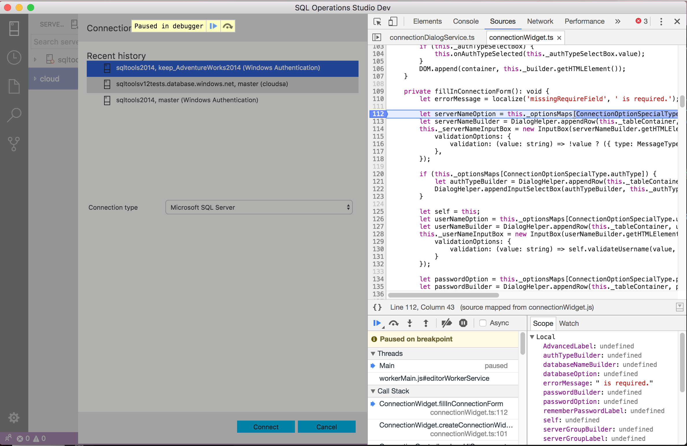

# Contributing to SQL Operations Studio
There are many ways to contribute to the SQL Operations Studio project: logging bugs, submitting pull requests, reporting issues, and creating suggestions.

## Build and Run From Source

If you want to understand how SQL Operations Studio works or want to debug an issue, you'll want to get the source, build it, and run the tool locally.

### Installing Prerequisites

* [git](https://git-scm.com)
* [Node.JS](https://nodejs.org/en/) (Node version v7.9.0 with npm 4.2.0).
* [Python](https://www.python.org/downloads/) (version `v2.7` recommended, `v3.x.x` is __*not*__ supported), as well as a C/C++ compiler tool chain.
* Note that if you get the error Error: %1 is not a valid Win32 application. you can fix that by running the gulp electron-ia32 command.
* If you don't have gulp installed run npm install gulp-cli -g first.

**Windows**
* **Warning:** [nodejs/node-gyp#972](https://github.com/nodejs/node-gyp/issues/972) causes compile errors if you are using Visual Studio 2015 (`error C2373: '__pfnDliNotifyHook2': redefinition;`) so make sure to have at least node.js v6.x installed that includes the fix
* **Warning:** [npm/npm#12698](https://github.com/npm/npm/issues/12698) prevents us from using `npm < 3.10.8`, be sure to install `npm >= 3.10.8` (`npm install -g npm@3.10.8`) after you have installed node.js.
* In addition to [Python v2.7](https://www.python.org/downloads/release/python-279/), make sure you have a PYTHON environment variable set to `drive:\path\to\python.exe`, not to a folder
* [Visual Studio 2013 for Windows Desktop](https://www.visualstudio.com/en-us/news/vs2013-community-vs.aspx?wt.mc_id=github_microsoft_vscode) or [Visual Studio 2015](https://www.visualstudio.com/en-us/products/visual-studio-community-vs.aspx?wt.mc_id=github_microsoft_vscode), make sure to select the option to install all C++ tools and the Windows SDK. You can also use Felix Rieseberg's [Windows Build Tools npm module](https://github.com/felixrieseberg/windows-build-tools). Then all you need is this one-liner
   ```
   npm install --global --production windows-build-tools
   ```

**OS X** 
* Command line developer tools
* Python should be installed already
* [Xcode](https://developer.apple.com/xcode/downloads/) and the Command Line Tools (Xcode -> Preferences -> Downloads), which will install `gcc` and the related toolchain containing `make`

**Linux**
* Python v2.7
* `make`
* A proper C/C++11 compiler tool chain, for example [GCC](https://gcc.gnu.org)
* [native-keymap](https://www.npmjs.com/package/native-keymap) needs `libx11-dev` and `libxkbfile-dev`.
  * On Debian-based Linux: `sudo apt-get install libx11-dev libxkbfile-dev`
  * On Red Hat-based Linux: `sudo yum install libX11-devel.x86_64 libxkbfile-devel.x86_64 # or .i686`.
* [keytar](https://www.npmjs.com/package/keytar) needs `libsecret-1-dev`.
  * On Debian-based Linux: `sudo apt-get install libsecret-1-dev`.
  * On Red Hat-based Linux: `sudo yum install libsecret-devel`.
* Building deb and rpm packages requires `fakeroot` and `rpm`, run: `sudo apt-get install fakeroot rpm`

### Build SQL Operations Studio
After you have these tools installed, run the following commands to clone github repository, install dependencies, and compile source code:

**OS X**

```bash
git clone https://github.com/microsoft/sqlopsstudio
cd sqlopsstudio
./scripts/npm.sh install
gulp compile
```

**Windows**

```bash
git clone https://github.com/microsoft/sqlopsstudio
cd sqlopsstudio
scripts\npm.bat install
gulp compile
```

**Linux**

```bash
git clone https://github.com/microsoft/sqlopsstudio
cd sqlopsstudio
./scripts/npm.sh install --arch=x64
gulp compile
# for 32bit Linux or Windows
#./scripts/npm.sh install --arch=ia32
```

**Note:** For more information on how to install NPM modules globally on UNIX systems without resorting to `sudo`, refer to [this guide](http://www.johnpapa.net/how-to-use-npm-global-without-sudo-on-osx/).

**Note:** To install SQL Operations Studio's dependencies as `root` (eg: Docker environments) make sure you use `--unsafe-perm` when invoking `./scripts/npm.sh`.

### Run SQL Operations Studio in debug mode.

**OS X and Linux**

```bash
./scripts/sql.sh
```

**Windows**

```bash
.\scripts\sql.bat
```

### Packaging

> if you encounter too many files opened error on macOS, run sudo launchctl limit maxfiles 200000 200000 then retry. The default settings is sudo launchctl limit maxfiles 256 unlimited

```bash
# for macOS
gulp --max_old_space_size=8192 vscode-darwin
cd ../carbon-darwin

# for windows
gulp –max_old_space_size=8192 vscode-win32-ia32
cd ../carbon-windows

# for linux
gulp –max_old_space_size=8192 vscode-linux-x64
cd ../carbon-linux
```

### Clean up build, npm modules and reset your local git repository to a clean state

```bash
git clean -fxd
```

## Development Workflow

### Incremental Build
From a terminal, where you have cloned the `sqlopsstudio` repository, execute the following command to run the TypeScript incremental builder:

```bash
npm run watch
```

It will do an initial full build and then watch for file changes, compiling those changes incrementally, enabling a fast, iterative coding experience.


### Debugging
You can either use VS Code or the Chrome Developer Tools to debug SQL Operations Studio.

#### Using VSCode
* Install the [Debugger for Chrome](https://marketplace.visualstudio.com/items/msjsdiag.debugger-for-chrome) extension. This extension will let you attach to and debug client side code running in Chrome.
* Open the `sqlopsstudio` repository folder
* Choose the `Launch sqlops` launch configuration from the launch dropdown in the Debug viewlet and press `F5`.


#### Using the Chrome Developer Tools

* Run the `Developer: Toggle Developer Tools` command from the Command Palette in your development instance of SQL Operations Studio to launch the Chrome tools.
* It's also possible to debug the released versions of SQL Operations Studio, since the sources link to sourcemaps hosted online.

  

### Automated Testing
Run the unit tests directly from a terminal by running `./scripts/test.sh` from the `sqlopsstudio` folder (`scripts\test` on Windows). The [test README](https://github.com/Microsoft/sqlopsstudio/blob/master/test/README.md) has complete details on how to run and debug tests, as well as how to produce coverage reports.

### Linting
We use [tslint](https://github.com/palantir/tslint) for linting our sources. You can run tslint across the sources by calling `gulp tslint` from a terminal or command prompt.

To lint the source as you make changes you can install the [tslint extension](https://marketplace.visualstudio.com/items/eg2.tslint). 

## Work Branches
Even if you have push rights on the Microsoft/sqlopsstudio repository, you should create a personal fork and create feature branches there when you need them. This keeps the main repository clean and your personal workflow cruft out of sight.

## Pull Requests
Before we can accept a pull request from you, you'll need to sign a [[Contributor License Agreement (CLA)|Contributor-License-Agreement]]. It is an automated process and you only need to do it once.

To enable us to quickly review and accept your pull requests, always create one pull request per issue and [link the issue in the pull request](https://github.com/blog/957-introducing-issue-mentions). Never merge multiple requests in one unless they have the same root cause. Be sure to follow our coding guidelines and keep code changes as small as possible. Avoid pure formatting changes to code that has not been modified otherwise. Pull requests should contain tests whenever possible. 

### Where to Contribute
Check out the [full issues list](https://github.com/Microsoft/sqlopsstudio/issues?utf8=%E2%9C%93&q=is%3Aopen+is%3Aissue) for a list of all potential areas for contributions. 

To improve the chances to get a pull request merged you should select an issue that is labelled with the [`help-wanted`](https://github.com/Microsoft/sqlopsstudio/issues?q=is%3Aopen+is%3Aissue+label%3A%22help+wanted%22) or [`bug`](https://github.com/Microsoft/sqlopsstudio/issues?q=is%3Aopen+is%3Aissue+label%3A%22bug%22) labels. If the issue you want to work on is not labelled with `help-wanted` or `bug`, you can start a conversation with the issue owner asking whether an external contribution will be considered.

## Suggestions
We're also interested in your feedback for the future of SQL Operations Studio. You can submit a suggestion or feature request through the issue tracker. To make this process more effective, we're asking that these include more information to help define them more clearly. 

## Discussion Etiquette

In order to keep the conversation clear and transparent, please limit discussion to English and keep things on topic with the issue. Be considerate to others and try to be courteous and professional at all times.

## Microsoft Open Source Code of Conduct
This project has adopted the [Microsoft Open Source Code of Conduct](https://opensource.microsoft.com/codeofconduct/). For more information see the [Code of Conduct FAQ](https://opensource.microsoft.com/codeofconduct/faq/) or contact [opencode@microsoft.com](mailto:opencode@microsoft.com) with any additional questions or comments.
