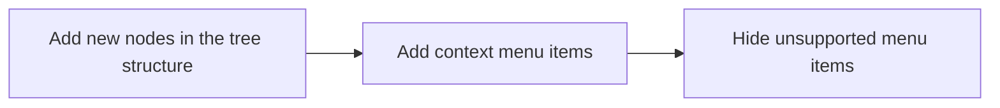

In addition to the built-in [VS Code tree views](https://vscode-westeu.azurewebsites.net/api/extension-guides/tree-view) which Azure Data Studio inherits, there are two main other types of trees that can be contributed to. 

# General Information

## Tree Nodes

Tree nodes are contributed by the providers registered for each type of tree, see below for more details.

## Context Menus

Context Menus are the menus of available actions that appear when a user right clicks on an item in a tree. These are often dynamically generated based on the "context" of the item in question, for example if you right click on a Database it will have different actions available than a table. 

Context menu items are added in one of two ways, depending on whether the contribution comes from an extension or from core. See below for details on the implementation for each area.

# Servers (Object Explorer)

The Servers (also commonly referred to as Object Explorer, similar to SSMS) tree view is the main tree view of the `Connections` view container. This is where server connections are listed, and custom providers can add their own nodes using `azdata.dataprotocol.registerObjectExplorerNodeProvider`. 

## Tree Nodes

Tree nodes for the Servers view are contributed by registering a provider in an extension with `azdata.dataprotocol.registerObjectExplorerProvider`. This is done automatically for providers that use the [defaultFeatures](https://github.com/Microsoft/sqlops-dataprotocolclient/blob/main/src/main.ts#L1331) of the sqlops-dataprotocolclient - although an extension can also choose to add the ObjectExplorerFeature directly when it creates its `SqlOpsDataClient`. In either case the extension itself needs to ensure that the data client implementation handles the [Object Explorer JSON RPC messages](https://github.com/microsoft/sqltoolsservice/blob/main/docs/guide/jsonrpc_protocol.md#object-explorer).

The tree is constructed by calling `expandNode` for the provider of the connection. The implementation of the provider here determines how it handles this request, but for providers that use a Data Protocol Client this will result in an `objectexplorer/expand` request being sent to the client. The nodes returned in the corresponding `objectexplorer/expandCompleted` notification will then be used to create the actual child nodes in the tree.

For documentation on the SQL Tools Service implementation of this and how to add new objects to the tree see [Object Explorer](https://github.com/microsoft/sqltoolsservice/blob/main/docs/guide/object_explorer.md).

## Context Menu

### Extensions

Contributed through the [objectExplorer/item/context
](https://github.com/microsoft/azuredatastudio/wiki/Contribution-points#objectexploreritemcontext) contribution point in your package.json. 

See [Context Variables](https://github.com/microsoft/azuredatastudio/wiki/Context-Variables) for information on Azure Data Studio-specific variables to control visibility. See [VS Code contributes.menus](https://code.visualstudio.com/api/references/contribution-points#contributes.menus) for general information on menu item contributions from extensions. 

### Core

Menu items are declared with `MenuRegistry.appendMenuItem` passing a `MenuId.ObjectExplorerItemContext` value as the MenuId. See [scripting.contribution](https://github.com/Microsoft/azuredatastudio/blob/main/src/sql/workbench/contrib/scripting/browser/scripting.contribution.ts) for examples. 

The [treeNodeContextKey](https://github.com/Microsoft/azuredatastudio/blob/main/src/sql/workbench/services/objectExplorer/common/treeNodeContextKey.ts), [connectionContextKey](https://github.com/Microsoft/azuredatastudio/blob/main/src/sql/workbench/services/connection/common/connectionContextKey.ts) and [serverInfoContextKey](https://github.com/Microsoft/azuredatastudio/blob/main/src/sql/workbench/services/connection/common/serverInfoContextKey.ts) are the main keys used control visibility of context menu items for the Servers view. 

## Adding new objects/nodes

Adding new objects or nodes to the Servers view will generally follow these steps

The last step is important, as many menu items are added by default to new items but may not necessarily apply to your new nodes. See the [Context Menu](https://github.com/microsoft/azuredatastudio/wiki/Servers-and-Data-Explorer-Tree-Views/#context-menu) section for details on how to hide a menu item for any new nodes being added.

# Data Explorer

This is a tree view that is declared with the [dataExplorer](https://github.com/microsoft/azuredatastudio/wiki/Contribution-points#dataexplorer) contribution point. You must also declare a `vscode.TreeDataProvider` to provider the tree items for the view. 

This is different from a normal TreeView in that it allows for displaying nodes from available providers (such as MSSQL) in Azure Data Studio. If you do not need this functionality then you should use a normal vscode.TreeView instead. 

Example: 

## Tree Nodes

Since this view uses the `vscode.TreeDataProvider` implementation you can just use that API to handle creating and updating nodes in the tree for all nodes that belong to the provider itself.

To use the functionality that allows creating sub-trees from different provides return an [azdata.TreeItem](https://github.com/Microsoft/azuredatastudio/blob/main/src/sql/azdata.d.ts#L2777) from the `TreeDataProvider.getChildren` call with the `childProvider` and `payload` properties set. This will cause a node from the provider specified by the `childProvider` property to be created, after which children of that node will be handled by the provider itself (through an [azdata.ObjectExplorerProvider](https://github.com/microsoft/azuredatastudio/blob/main/src/sql/azdata.d.ts#L1425), which you can refer to the Servers Tree section for information on the implementation).

## Context Menu 

### Extensions

Contributed through the [dataExplorer/context](https://github.com/microsoft/azuredatastudio/wiki/Contribution-points#dataexplorercontext) contribution point in your package.json. 

See [Context Variables](https://github.com/microsoft/azuredatastudio/wiki/Context-Variables) for information on Azure Data Studio-specific variables to control visibility. See [VS Code contributes.menus](https://code.visualstudio.com/api/references/contribution-points#contributes.menus) for general information on menu item contributions from extensions. 

### Core

Menu items are declared with `MenuRegistry.appendMenuItem` passing a `MenuId.DataExplorerContext` value as the MenuId. See [scripting.contribution](https://github.com/Microsoft/azuredatastudio/blob/main/src/sql/workbench/contrib/scripting/browser/scripting.contribution.ts) for examples. 

The [MssqlNodeContext](https://github.com/Microsoft/azuredatastudio/blob/main/src/sql/workbench/services/objectExplorer/browser/mssqlNodeContext.ts) context key controls visibility nodes contributed by the MSSQL provider. 
